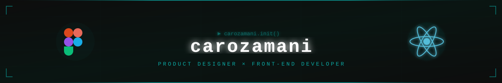
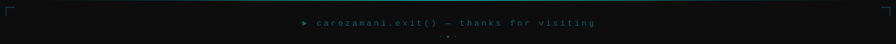

<div align="center">
  
  <br/>
  
</div>


## ⌁ ABOUT.exe

```
> whoami --role
```

`PRODUCT DESIGNER × FRONT-END DEVELOPER`

`> mission`

`Design isn't a handoff — it's a full loop. I research, design the`
`system, then ship it myself in React when that's what it takes.`

<table>
  <tr>
    <td width="50%" valign="top">
      🎨 <b>Design-led</b><br/>
      Research → flows → UI systems → prototypes. Every product decision starts here.
    </td>
    <td width="50%" valign="top">
      ⚛️ <b>Engineering-capable</b><br/>
      I build what I design with React / Next.js — and step in as a front-end dev on any project that needs it.
    </td>
  </tr>
  <tr>
    <td width="50%" valign="top">
      🛰️ <b>Leveling up</b><br/>
      Expanding downward into the stack — currently learning PostgreSQL & Python.
    </td>
    <td width="50%" valign="top">
      🌐 <b>Portfolio</b><br/>
      Full case studies live at <a href="https://carozamani.com/">carozamani.com</a>.
    </td>
  </tr>
</table>


## ⌁ STACK.config

<div align="center">

**Design** &nbsp;  &nbsp; 

**Build** &nbsp;  &nbsp;  &nbsp;  &nbsp;  &nbsp; 

**Expanding into** &nbsp;  &nbsp; 

</div>


## ⌁ ACTIVE_MISSION.log

🎓 **Internship Management Platform** — a full software product for a university, covering the entire student-internship workflow end to end. Owning the product design and stepping into front-end implementation wherever it's needed.


## ⌁ CONNECT.link

<div align="center">

[](https://linkedin.com/in/carozamani)
[](https://behance.net/carozamani)
[](https://carozamani.com/)
[](mailto:carozamani@gmail.com)

</div>


