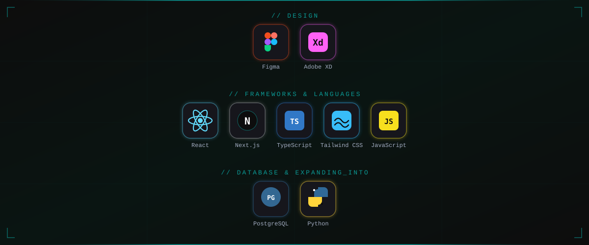
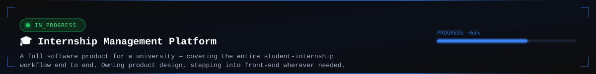

 

## ⌁ ABOUT.me

&nbsp;

&nbsp;

&nbsp;

I'm a **Product Designer & Front-End Developer**. Design isn't a handoff for me — it's a full loop: I research, design the system, then ship it myself in React when that's what it takes.

Currently expanding downward into the stack, picking up **PostgreSQL** & **Python** along the way.

🌐 Full case studies at [carozamani.com](https://carozamani.com/)

## ⌁ STACK.config

## ⌁ ACTIVE_MISSION.log

